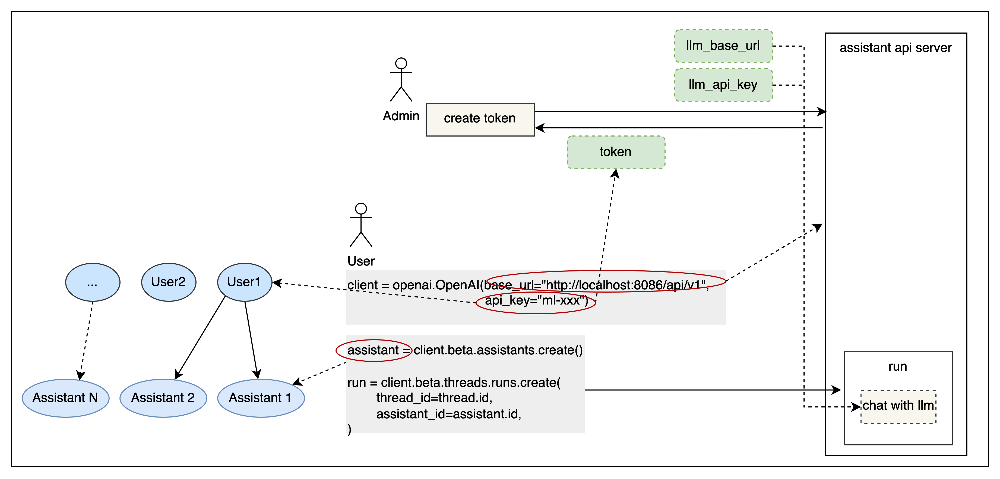

<div align="center">

# Open Assistant API

_✨ すぐに使える AI インテリジェントアシスタント API ✨_

</div>

<p align="center">
  <a href="./README.md">English</a> |
  <a href="./README_CN.md">简体中文</a> |
  <a href="./README_JP.md">日本語</a>
</p>

## 紹介

Open Assistant API は、オープンソースのセルフホスティング型 AI インテリジェントアシスタント API であり、OpenAI 公式インターフェースと互換性があります。OpenAI 公式の [Client](https://github.com/openai/openai-python) を使用して LLM アプリケーションを構築することができます。

[One API](https://github.com/songquanpeng/one-api) をサポートしており、より多くの商用およびプライベートモデルと統合できます。

[R2R](https://github.com/SciPhi-AI/R2R) RAG エンジンをサポートしています。

## 使用方法

以下は、OpenAI 公式の Python `openai` ライブラリを使用した例です:

```python
import openai

client = openai.OpenAI(
    base_url="http://127.0.0.1:8086/api/v1",
    api_key="xxx"
)

assistant = client.beta.assistants.create(
    name="demo",
    instructions="You are a helpful assistant.",
    model="gpt-4-1106-preview"
)
```

## なぜ Open Assistant API を選ぶのか

| 機能                  | Open Assistant API | OpenAI Assistant API |
|----------------------|--------------------|----------------------|
| エコシステム戦略          | オープンソース            | クローズドソース            |
| RAG エンジン           | R2R をサポート           | サポートされている            |
| インターネット検索         | サポートされている           | サポートされていない           |
| カスタム関数            | サポートされている           | サポートされている            |
| 内蔵ツール              | 拡張可能                | 拡張不可                 |
| コードインタープリタ       | 開発中                 | サポートされている            |
| マルチモーダル            | サポートされている           | サポートされている            |
| LLM サポート           | より多くの LLM をサポート      | GPT のみ                |
| メッセージストリーミング出力   | サポートされている           | サポートされている            |
| ローカルデプロイメント       | サポートされている           | サポートされていない           |

- **LLM サポート**: 公式の OpenAI バージョンと比較して、One API を統合することでより多くのモデルをサポートできます。
- **ツール**: 現在、オンライン検索をサポートしています。より多くのツールを簡単に拡張できます。
- **RAG エンジン**: 現在サポートされているファイルタイプは txt、html、markdown、pdf、docx、pptx、xlsx、png、mp3、mp4 などです。初期実装を提供しています。
- **メッセージストリーミング出力**: メッセージストリーミング出力をサポートし、よりスムーズなユーザー体験を提供します。
- **エコシステム戦略**: オープンソースであり、サービスをローカルにデプロイし、既存の機能を拡張することができます。

## クイックスタート

Open Assistant API を開始する最も簡単な方法は、docker-compose.yml ファイルを実行することです。実行する前に、マシンに Docker と Docker Compose がインストールされていることを確認してください。

### 設定

プロジェクトのルートディレクトリに移動し、`docker-compose.yml` を開いて、openai api_key と bing search key（オプション）を入力します。

```sh
# openai api_key (OneAPI api_key をサポート)
OPENAI_API_KEY=<openai_api_key>

# bing search key（オプション）
BING_SUBSCRIPTION_KEY=<bing_subscription_key>
```

R2R RAG エンジンを設定して、デフォルトの RAG 実装を置き換え、より優れた RAG 機能を提供することをお勧めします。R2R については、[R2R Github リポジトリ](https://github.com/SciPhi-AI/R2R) を通じて学び、使用することができます。

```sh
# RAG 設定
# FILE_SERVICE_MODULE=app.services.file.impl.oss_file.OSSFileService
FILE_SERVICE_MODULE=app.services.file.impl.r2r_file.R2RFileService
R2R_BASE_URL=http://<r2r_api_address>
R2R_USERNAME=<r2r_username>
R2R_PASSWORD=<r2r_password>
```

### 実行

#### Docker Compose を使用して実行:

 ```sh
docker compose up -d
 ```

### API にアクセス

Api Base URL: http://127.0.0.1:8086/api/v1

インターフェースドキュメントのアドレス: http://127.0.0.1:8086/docs

### 完全な使用例

この例では、公式の OpenAI クライアントライブラリを使用して AI アシスタントを作成し、実行します。他の使用方法（ストリーミング出力、ツール（web_search、retrieval、function）など）を確認する場合は、examples ディレクトリで対応するコードを見つけることができます。実行する前に、Python `openai` ライブラリをインストールするために `pip install openai` を実行する必要があります。

```sh
# !pip install openai
export PYTHONPATH=$(pwd)
python examples/run_assistant.py
```

### 権限
トークンに基づいて簡単なユーザー分離を提供し、SaaS デプロイメント要件を満たします。`APP_AUTH_ENABLE` を設定することで有効にできます。



1. 認証方法は Bearer トークンです。ヘッダーに `Authorization: Bearer ***` を含めて認証を行うことができます。
2. トークン管理は API ドキュメントのトークンセクションに記載されています。関連する API は管理者トークンで認証する必要があり、`APP_AUTH_ADMIN_TOKEN` として設定され、デフォルトでは "admin" です。
3. トークンを作成する際には、大規模モデルのベース URL と API キーを提供する必要があります。作成されたアシスタントは、対応する設定を使用して大規模モデルにアクセスします。

### ツール
OpenAPI/Swagger 仕様に従って、さまざまなツールをアシスタントに統合することができ、外部の世界と接続する能力を強化します。

1. アプリケーションを他のシステムやサービスと接続し、外部環境と対話することができます。たとえば、コードの実行や専用情報源へのアクセスなどです。
2. 使用中にツールを作成し、その後アシスタントと組み合わせることができます。詳細はテストケースを参照してください。[Assistant With Action](tests/tools/assistant_action_test.py)
3. 認証情報を持つツールを使用する必要がある場合は、実行時に認証情報を追加するだけです。具体的なパラメータ形式は API ドキュメントで確認できます。詳細はテストケースを参照してください。[Run With Auth Action](tests/tools/run_with_auth_action_test.py)

## コミュニティとサポート

- [Slack](https://join.slack.com/t/openassistant-qbu7007/shared_invite/zt-29t8j9y12-9og5KZL6GagXTEvbEDf6UQ) チャンネルに参加して、新しいリリースを確認し、問題を議論し、コミュニティの交流に参加してください。
- [Discord](https://discord.gg/VfBruz4B) チャンネルに参加して、他のコミュニティメンバーと交流してください。
- Open Assistant Api WeChat グループに参加してください：

  

## 特別な感謝

主に以下のプロジェクトを参考にし、依存しています：

- [OpenOpenAI](https://github.com/transitive-bullshit/OpenOpenAI): Node で実装された Assistant API
- [One API](https://github.com/songquanpeng/one-api): マルチモデル管理ツール
- [R2R](https://github.com/SciPhi-AI/R2R): RAG エンジン
- [OpenAI-Python](https://github.com/openai/openai-python): OpenAI Python クライアント
- [OpenAI API](https://github.com/openai/openai-openapi): OpenAI インターフェース定義
- [LangChain](https://github.com/langchain-ai/langchain): LLM アプリケーション開発ライブラリ
- [OpenGPTs](https://github.com/langchain-ai/opengpts): LangChain GPTs
- [TaskingAI](https://github.com/TaskingAI/TaskingAI): TaskingAI クライアント SDK

## 貢献

貢献方法については、[貢献ドキュメント](./docs/CONTRIBUTING.md) をお読みください。

## オープンソースライセンス

このリポジトリは MIT オープンソースライセンスに従います。詳細については、[LICENSE](./LICENSE) ファイルを参照してください。
